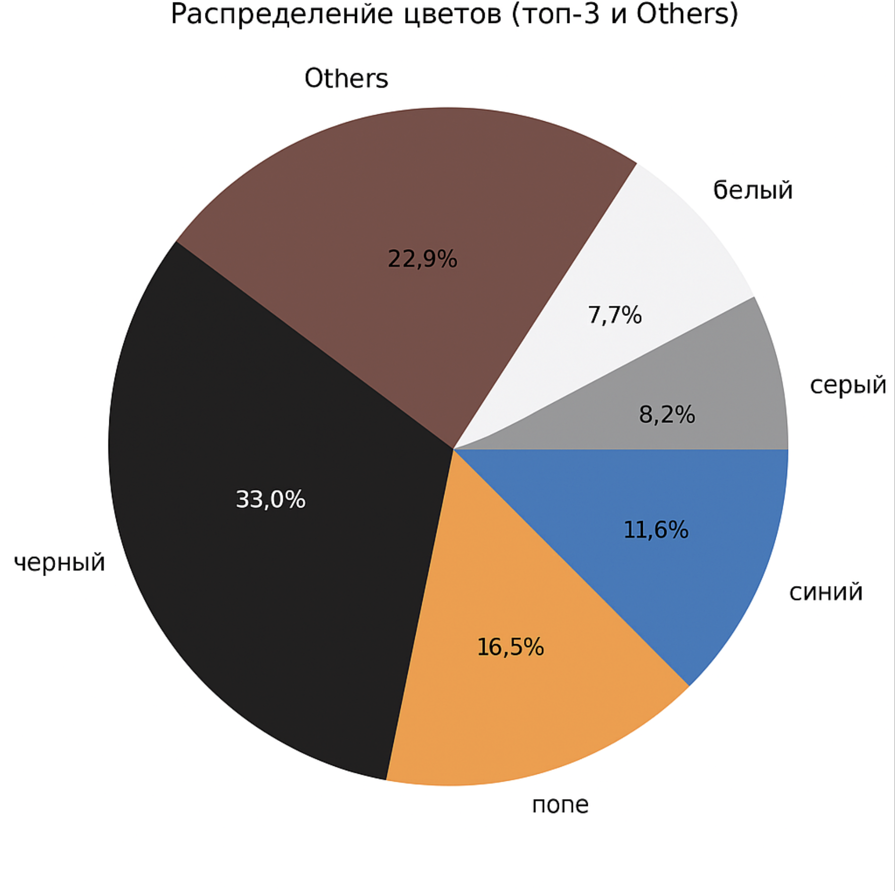
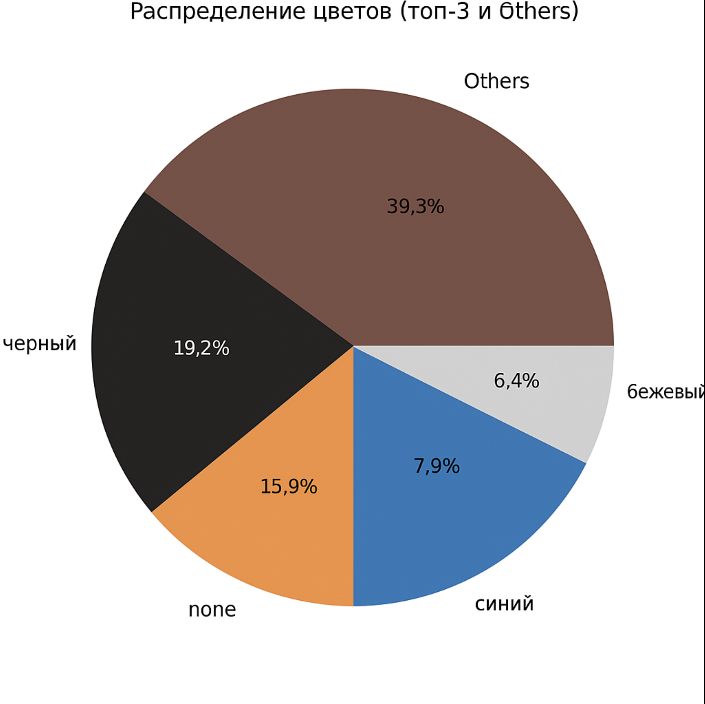
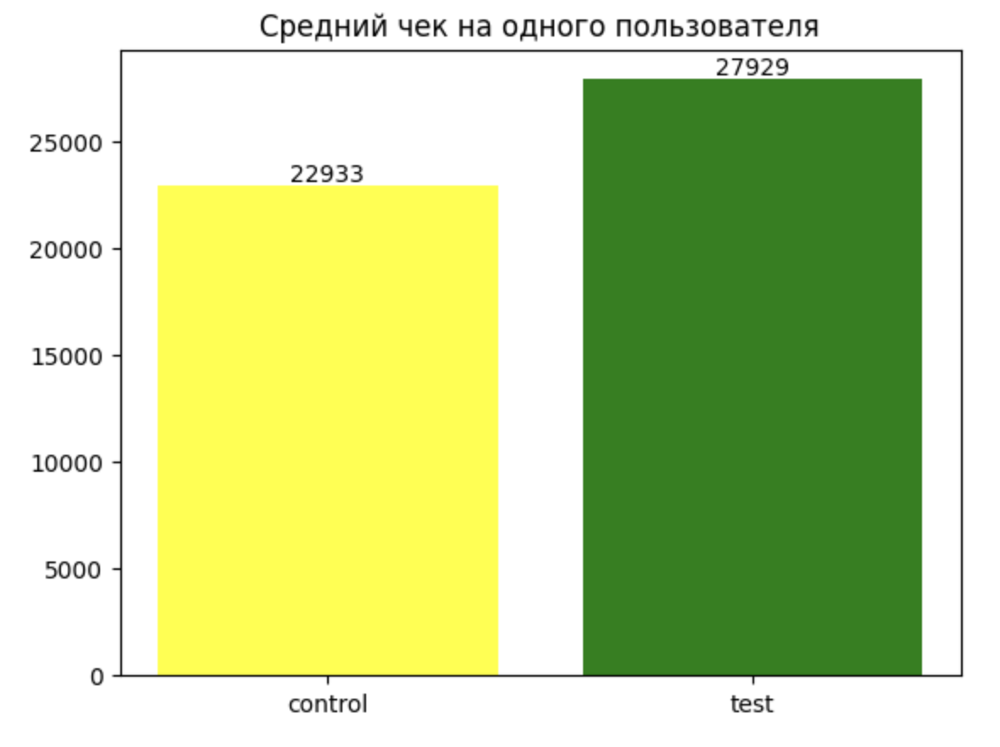
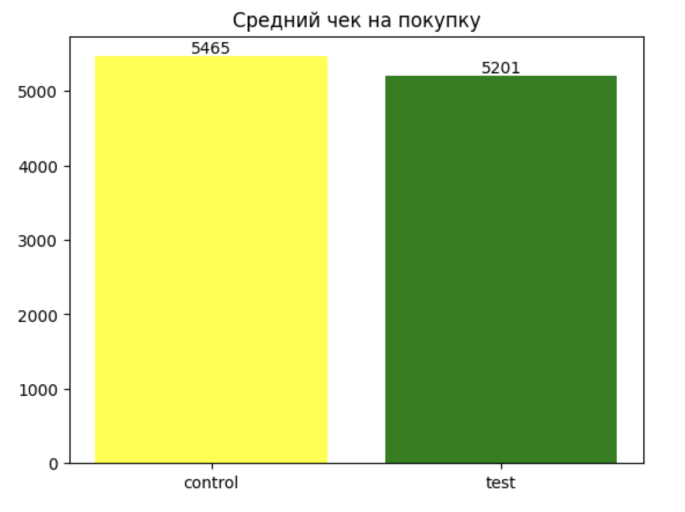
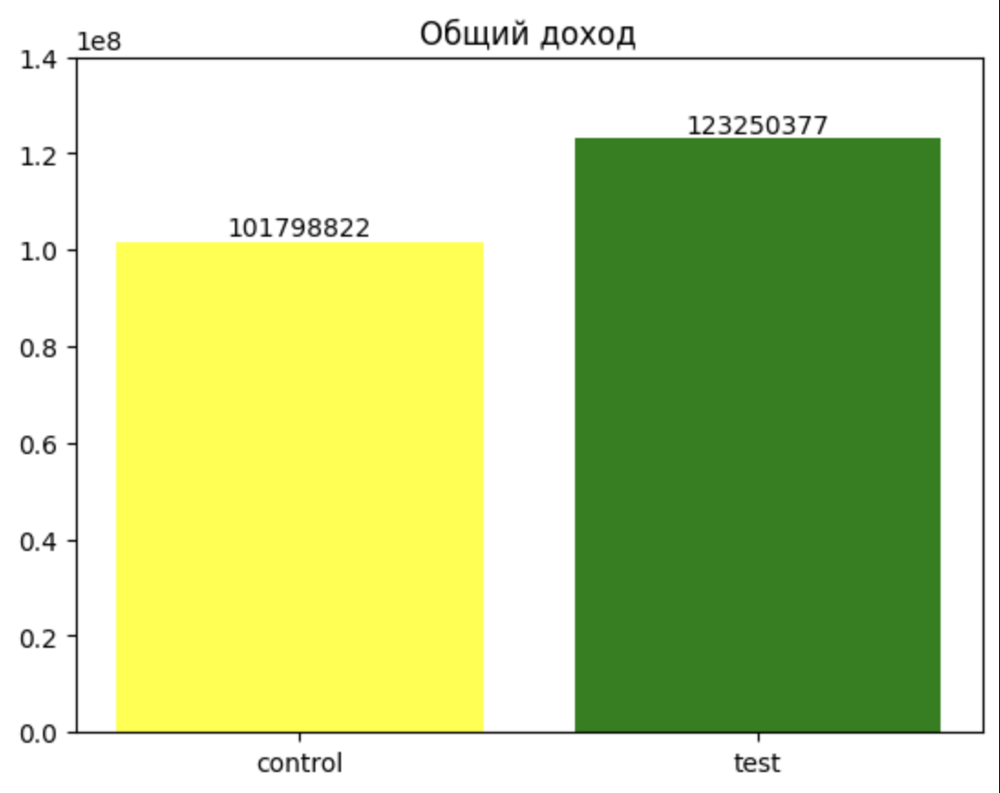
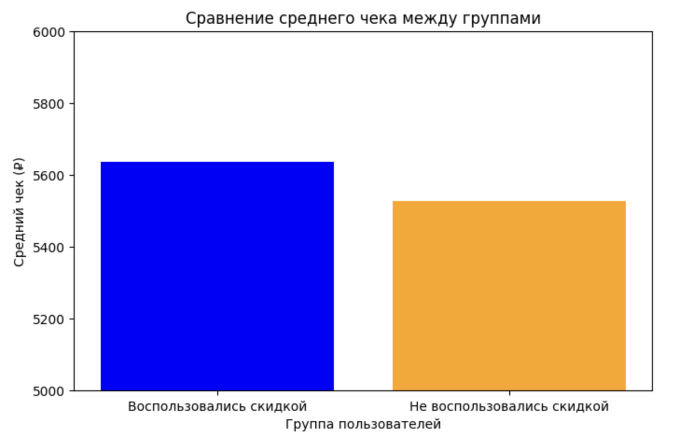
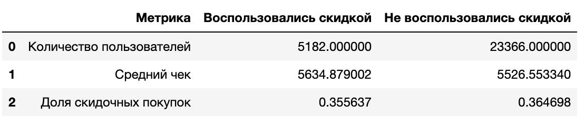

# Marketing Campaign Analysis for a Sports Retailer

## Project Overview

This project focuses on analyzing customer behavior and the effectiveness of marketing campaigns using data from a major sports retailer. Data analysis tools and machine learning methods were employed to explore key metrics, test hypotheses, and propose improvements for future campaigns.

---

## ⚙️ Project Stages

### 1. Data Loading and Initial Filtering
- Unzipped and loaded data.
- Detected missing values in the **gender** field.
- Filtered only data for **Country 32**.

---

### 2. Data Preparation

Purchase table analysis:
- Found inconsistencies in color names.
- Missing color values.

**Solutions:**
- Replaced **"Ё" with "Е"**
- Converted to **lowercase**
- Removed unnecessary characters ('-', '/', ',')
- Built charts showing popular product colors separately for men and women.
- Missing values were filled with the most frequent color for each gender based on visual analysis:

  

---

### 3. Feature Engineering

Added features:
- **Company** — product company name. Extracted as the first English word from the product description.
- **Product_type** — product type. Extracted as the first word of the description, with the last three characters removed to avoid grammatical variation.
- **Price_category** — product price category:
  - High level
  - Medium level
  - Low level

---

### 4. Gender Imputation Model

Goal: recover missing gender values based on purchase data.

**Approach:**
- Built a binary classification model (male/female).
- Features used:
  - Product color
  - Company
  - Product type
  - Price category
  - Customer age
- Applied encoding and trained a Random Forest Classifier.

**Results:**
- Model achieved ~80% accuracy.
- Predicted gender values were assigned to customers with missing data.
- Final merged dataset created with recovered values.

---

### 5. Preparing Data for Campaign Analysis

- Loaded tables of customers who participated and did not participate in marketing campaigns.
- Cleaned and merged them with the purchase dataset.
- Divided users into control and test groups for:
  - *first_campaign*
  - *second_campaign*

---

### 6. Key A/B Test Metrics

Analyzed main metrics for each campaign in preparation for statistical testing:

#### First Campaign:
- Average Revenue Per User (ARPU)
- Average Order Value (AOV)
- Total revenue by group
- Purchase amount difference between groups

#### Second Campaign:
- Number of unique users
- Average check
- Conversion rate
- Share of customers who used the discount
- Share of products bought with a discount (by value)

---

### 7. 📊 A/B Testing

Analyzed campaign effectiveness using A/B testing on key metrics with **t-tests**.

#### 🧪 First Campaign

##### 📌 Metric: ARPU (Average Revenue Per User)
- **H₀:** No difference in ARPU between groups.
- **H₁:** ARPU differs between groups.
- **t-test result:**  
  *(p-value < 0.05)*
- **Conclusion:**  
  *Users with discounts had significantly higher ARPU.*

---

##### 📌 Metric: AOV (Average Order Value)
- **H₀:** No difference in AOV between groups.
- **H₁:** AOV differs between groups.
- **t-test result:**  
  *(p-value < 0.05)*
- **Conclusion:**  
  *AOV was slightly lower in the discount group, as expected.*

---

📉 **Additional:**  
Bar chart showing total revenue for each group:

---

#### Second Campaign

##### Metric: AOV (Average Order Value)
- **H₀:** No difference in AOV between groups.
- **H₁:** AOV differs between groups.
- **t-test result:**  
  *(p-value = 0.268)*
- **Conclusion:**  
  *Discount had no significant impact on AOV.*

---

📊 **Additional:**  
Table dividing customers who used vs. did not use the discount, with analysis of behavior and average check.

---

### 8. Summary of Campaign Results

- **First Campaign:**  
  *Lower AOV with discounts, but significantly higher ARPU. Overall revenue higher for discount group, indicating campaign success.*

- **Second Campaign:**  
  *No significant difference in AOV — campaign not effective.*

- **Conclusion:**  
  *First campaign is worth scaling. Second campaign should be reconsidered.*

---

### 9. Predictive Model for Customers from City 1188

#### Data Preparation:
- Filtered clients from city 1188.
- Removed rarely purchased product categories to reduce noise.

#### Model Training:
- Trained two ML models:
  - `Decision Tree Classifier`
  - `Random Forest Classifier`
- Compared results on validation data.
- Chose decision tree for interpretability and sufficient accuracy.

#### Model Export:
- Decision tree model was **saved/downloaded** for further use.

